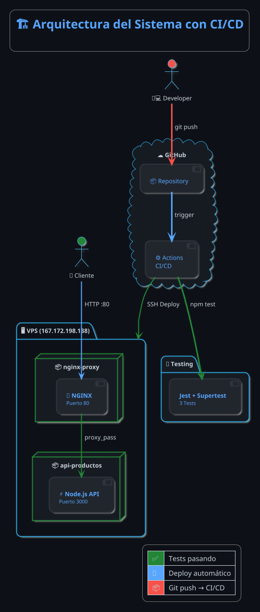

# 📄 Reporte Técnico
## Arquitectura de Despliegue, Pruebas y Monitoreo de Aplicaciones

---

<div align="center">

# 🎓 UNIVERSIDAD / INSTITUCIÓN

## 📚 Evaluación Final

### **Arquitectura de Despliegue, Pruebas y Monitoreo de Aplicaciones**

---

### 👥 Integrantes del Equipo

| # | Nombre Completo | Matrícula |
|:-:|-----------------|-----------|
| 1 | [Nombre del Integrante 1] | [Matrícula] |
| 2 | [Nombre del Integrante 2] | [Matrícula] |
| 3 | [Nombre del Integrante 3] | [Matrícula] |

---

**📅 Fecha de Entrega:** 30 de Noviembre de 2025

</div>

---

## 📋 Índice

1. [Introducción](#1-introducción)
2. [Arquitectura del Sistema](#2-arquitectura-del-sistema)
3. [Configuración Técnica](#3-configuración-técnica)
4. [Pipeline CI/CD](#4-pipeline-cicd)
5. [Pruebas de Integración](#5-pruebas-de-integración)
6. [Evidencias y Capturas](#6-evidencias-y-capturas)
7. [Conclusiones](#7-conclusiones)

---

## 1. Introducción

Este proyecto implementa una arquitectura robusta que integra:

| Componente | Tecnología | Descripción |
|------------|------------|-------------|
| 🧪 Pruebas | Supertest + Jest | Validación de endpoints |
| 🐳 Contenedores | Docker + Compose | Contenerización de servicios |
| 🔄 Proxy | Nginx | Proxy inverso |
| 🚀 CI/CD | GitHub Actions | Pipeline automatizado |

**Proyecto:** API REST de gestión de productos con operaciones CRUD.

---

## 2. Arquitectura del Sistema

### 2.1 Diagrama de Arquitectura (PlantUML)



### 2.2 Flujo CI/CD

| Paso | Acción | Descripción |
|:----:|--------|-------------|
| 1️⃣ | `git push` | Developer sube código |
| 2️⃣ | GitHub Actions | Se dispara el pipeline |
| 3️⃣ | `npm test` | Ejecuta los 3 tests |
| 4️⃣ | SSH Deploy | Conecta al VPS |
| 5️⃣ | Docker Build | Reconstruye contenedores |
| 6️⃣ | Health Check | Verifica deployment |

### 2.3 Estructura del Proyecto

```
📁 proyecto_completo/
├── 📁 .github/
│   └── 📁 workflows/
│       └── 📄 deploy.yml      # Pipeline CI/CD
├── 📁 src/
│   └── 📄 app.js              # API Express
├── 📁 tests/
│   └── 📄 api.test.js         # 3 pruebas
├── 📁 nginx/
│   ├── 📄 nginx.conf          # Config principal
│   └── 📁 conf.d/
│       └── 📄 default.conf    # Proxy inverso
├── 🐳 Dockerfile
├── 🐳 docker-compose.yml
└── 📄 README.md
```

---

## 3. Configuración Técnica

### 3.1 Docker Compose

| Servicio | Contenedor | Puerto | Función |
|----------|------------|--------|---------|
| `api` | api-productos | 3000 (interno) | API Node.js |
| `nginx` | nginx-proxy | 80 (externo) | Proxy inverso |

### 3.2 Nginx (Proxy Inverso)

| Configuración | Valor |
|---------------|-------|
| `proxy_pass` | http://api:3000 |
| Headers de seguridad | X-Frame-Options, X-XSS-Protection |

---

## 4. Pipeline CI/CD

### 4.1 GitHub Actions Workflow

El pipeline está configurado en `.github/workflows/deploy.yml` y ejecuta:

```yaml
Jobs:
  1. test    → Ejecuta npm test (3 tests con Supertest)
  2. deploy  → Si tests pasan, despliega a VPS via SSH
```

### 4.2 Configuración de Secrets en GitHub

Para que el pipeline funcione, configurar estos secrets en el repositorio:

| Secret | Descripción |
|--------|-------------|
| `VPS_SSH_KEY` | Llave privada SSH para conectar al VPS |

### 4.3 Pasos para Configurar

1. **Generar par de llaves SSH** (si no existe):
   ```bash
   ssh-keygen -t rsa -b 4096 -C "deploy@github"
   ```

2. **Agregar llave pública al VPS**:
   ```bash
   ssh-copy-id root@167.172.198.138
   ```

3. **Agregar llave privada a GitHub**:
   - Ir a: Repository → Settings → Secrets and variables → Actions
   - New repository secret: `VPS_SSH_KEY`
   - Pegar contenido de `~/.ssh/id_rsa`

---

## 5. Pruebas de Integración

### 5.1 Resumen de Pruebas (3 Tests)

| # | Endpoint | Método | Prueba | Estado |
|:-:|----------|:------:|--------|:------:|
| 1 | `/health` | GET | Estado del servidor | ✅ |
| 2 | `/api/productos` | GET | Listar productos | ✅ |
| 3 | `/api/productos` | POST | Crear producto | ✅ |

---

## 6. Evidencias y Capturas

---

### 📸 6.1 Pruebas Pasando Exitosamente

> **Comando:** `npm test`

<div align="center">

| 🧪 CAPTURA DE TESTS PASANDO |
|:---------------------------:|
| |
| **(CAPTURA AQUÍ)** |
| |

</div>

**✅ Resultado esperado:** 3 passed

---

### 📸 6.2 Contenedores Docker Funcionando

> **Comando:** `docker-compose ps`

<div align="center">

| 🐳 CAPTURA DE CONTENEDORES |
|:--------------------------:|
| |
| **(CAPTURA AQUÍ)** |
| |

</div>

**✅ Contenedores esperados:**
- `api-productos` → Up (healthy)
- `nginx-proxy` → Up → 0.0.0.0:80→80/tcp

---

### 📸 6.3 Pipeline CI/CD Ejecutándose

> **GitHub Actions**

<div align="center">

| 🚀 CAPTURA DEL PIPELINE |
|:-----------------------:|
| |
| **(CAPTURA AQUÍ)** |
| |

</div>

**✅ Jobs esperados:**
- ✅ test (Ejecutar Tests)
- ✅ deploy (Deploy a VPS)

---

### 📸 6.4 API en Producción (VPS)

> **Comando:** `curl http://167.172.198.138/health`

<div align="center">

| 🌐 CAPTURA API EN VPS |
|:---------------------:|
| |
| **(CAPTURA AQUÍ)** |
| |

</div>

**✅ Respuesta esperada:** `{"status":"OK"}`

---

## 7. Conclusiones

### ✅ Requisitos Cumplidos

| Requisito | Estado |
|-----------|:------:|
| Pruebas de Integración (Supertest) | ✅ |
| Contenerización (Docker) | ✅ |
| Proxy Inverso (Nginx) | ✅ |
| Pipeline CI/CD (GitHub Actions) | ✅ |
| Deploy automático a VPS | ✅ |

### 📝 Aprendizajes

- **Supertest** permite validar APIs de forma aislada
- **Docker** garantiza entornos consistentes
- **Nginx** actúa como proxy inverso seguro
- **GitHub Actions** automatiza el ciclo de deployment

---

<div align="center">

---

### 📚 Proyecto desarrollado para la evaluación de
## Arquitectura de Despliegue, Pruebas y Monitoreo

*🗓️ Noviembre 2025*

---

</div>
