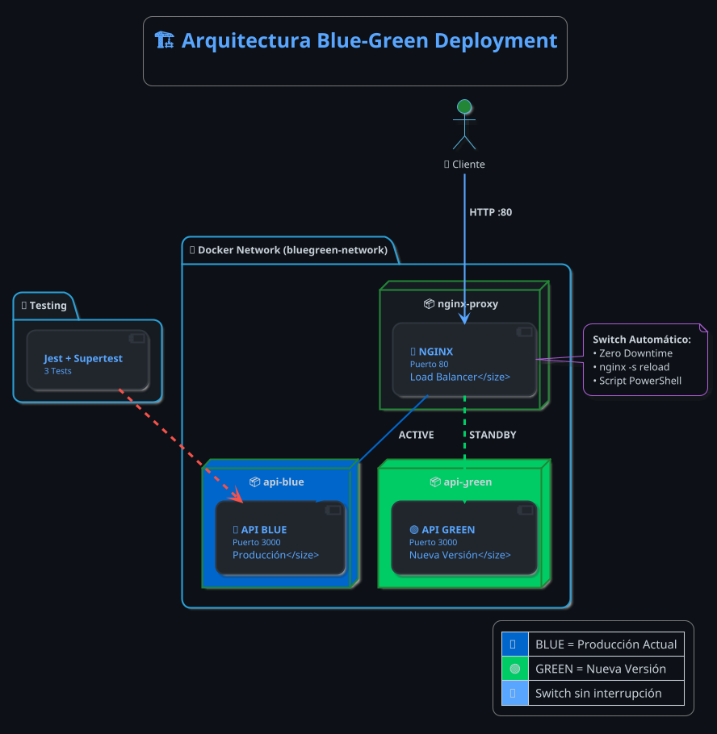

# 📄 Reporte Técnico
## Arquitectura de Despliegue, Pruebas y Monitoreo de Aplicaciones

---

<div align="center">

# 🎓 UNIVERSIDAD / INSTITUCIÓN

## 📚 Evaluación Final

### **Arquitectura de Despliegue, Pruebas y Monitoreo de Aplicaciones**

---

### 👥 Integrantes del Equipo

| # | Nombre Completo | Matrícula |
|:-:|-----------------|-----------|
| 1 | [Nombre del Integrante 1] | [Matrícula] |
| 2 | [Nombre del Integrante 2] | [Matrícula] |
| 3 | [Nombre del Integrante 3] | [Matrícula] |

---

**📅 Fecha de Entrega:** 30 de Noviembre de 2025

</div>

---

## 📋 Índice

1. [Introducción](#1-introducción)
2. [Arquitectura del Sistema](#2-arquitectura-del-sistema)
3. [Configuración Técnica](#3-configuración-técnica)
4. [Blue-Green Deployment](#4-blue-green-deployment)
5. [Pruebas de Integración](#5-pruebas-de-integración)
6. [Evidencias y Capturas](#6-evidencias-y-capturas)
7. [Conclusiones](#7-conclusiones)

---

## 1. Introducción

Este proyecto implementa una arquitectura robusta que integra:

| Componente | Tecnología | Descripción |
|------------|------------|-------------|
| 🧪 Pruebas | Supertest + Jest | Validación de endpoints |
| 🐳 Contenedores | Docker + Compose | Contenerización de servicios |
| 🔄 Proxy | Nginx | Proxy inverso y balanceo |
| 🔵🟢 Blue-Green | Nginx + Scripts | Zero Downtime Deployment |

**Proyecto:** API REST de gestión de productos con operaciones CRUD.

---

## 2. Arquitectura del Sistema

### 2.1 Diagrama de Arquitectura Blue-Green (PlantUML)



### 2.2 Flujo de Comunicación

| Paso | Origen | Destino | Descripción |
|:----:|--------|---------|-------------|
| 1️⃣ | Cliente | Nginx:80 | Petición HTTP |
| 2️⃣ | Nginx | API-BLUE o API-GREEN | Según entorno activo |
| 3️⃣ | API | Nginx | Respuesta JSON |
| 4️⃣ | Nginx | Cliente | Respuesta + Headers |

### 2.3 Estructura del Proyecto

```
📁 proyecto_completo/
├── 📁 src/
│   └── 📄 app.js              # API Express
├── 📁 tests/
│   └── 📄 api.test.js         # 3 pruebas
├── 📁 nginx/
│   ├── 📄 nginx.conf          # Config principal
│   └── 📁 conf.d/
│       └── 📄 default.conf    # Blue-Green Config
├── 📁 scripts/
│   ├── 📄 switch.ps1          # Switch Windows
│   └── 📄 switch.sh           # Switch Linux/Mac
├── 🐳 Dockerfile
├── 🐳 docker-compose.yml
└── 📄 README.md
```

---

## 3. Configuración Técnica

### 3.1 Docker Compose - Blue-Green

| Servicio | Contenedor | Puerto | Función |
|----------|------------|--------|---------|
| `api-blue` | api-blue | 3000 (interno) | Producción actual |
| `api-green` | api-green | 3000 (interno) | Nueva versión |
| `nginx` | nginx-proxy | 80 (externo) | Load Balancer / Switch |

### 3.2 Nginx - Configuración Blue-Green

| Upstream | Servidor | Descripción |
|----------|----------|-------------|
| `api_blue` | api-blue:3000 | Entorno BLUE |
| `api_green` | api-green:3000 | Entorno GREEN |
| `api_active` | Configurable | Entorno activo |

---

## 4. Blue-Green Deployment

### 4.1 ¿Qué es Blue-Green Deployment?

Es una estrategia de despliegue que mantiene **dos entornos idénticos**:
- 🔵 **BLUE**: Versión actual en producción
- 🟢 **GREEN**: Nueva versión lista para activar

### 4.2 Ventajas

| Ventaja | Descripción |
|---------|-------------|
| ⚡ Zero Downtime | Sin interrupción del servicio |
| 🔄 Rollback instantáneo | Volver a versión anterior en segundos |
| 🧪 Testing en producción | Probar GREEN antes de activar |

### 4.3 Endpoints Disponibles

| Endpoint | Descripción |
|----------|-------------|
| `http://localhost/health` | Entorno activo |
| `http://localhost/blue-health` | Health de BLUE |
| `http://localhost/green-health` | Health de GREEN |
| `http://localhost/blue/api/productos` | API en BLUE |
| `http://localhost/green/api/productos` | API en GREEN |

### 4.4 Script de Switch

```powershell
# Ejecutar switch interactivo
.\scripts\switch.ps1
```

El script permite:
1. Ver estado de ambos entornos
2. Cambiar tráfico a BLUE
3. Cambiar tráfico a GREEN
4. Verificar entorno activo

---

## 5. Pruebas de Integración

### 5.1 Resumen de Pruebas (3 Tests)

| # | Endpoint | Método | Prueba | Estado |
|:-:|----------|:------:|--------|:------:|
| 1 | `/health` | GET | Estado del servidor + versión | ✅ |
| 2 | `/api/productos` | GET | Listar productos + estructura | ✅ |
| 3 | `/api/productos` | POST | Crear nuevo producto | ✅ |

---

## 6. Evidencias y Capturas

---

### 📸 6.1 Pruebas Pasando Exitosamente

> **Comando:** `npm test`

<div align="center">

| 🧪 CAPTURA DE TESTS PASANDO |
|:---------------------------:|
| |
| **(CAPTURA AQUÍ)** |
| |

</div>

**✅ Resultado esperado:** 3 passed

---

### 📸 6.2 Contenedores Blue-Green Funcionando

> **Comando:** `docker-compose ps`

<div align="center">

| 🐳 CAPTURA DE CONTENEDORES BLUE-GREEN |
|:-------------------------------------:|
| |
| **(CAPTURA AQUÍ)** |
| |

</div>

**✅ Contenedores esperados:**
- `api-blue` → Up (healthy) → 3000/tcp
- `api-green` → Up (healthy) → 3000/tcp
- `nginx-proxy` → Up → 0.0.0.0:80→80/tcp

---

### 📸 6.3 Entorno BLUE Activo

> **Comando:** `curl http://localhost/health`

<div align="center">

| 🔵 CAPTURA ENTORNO BLUE |
|:-----------------------:|
| |
| **(CAPTURA AQUÍ)** |
| |

</div>

**✅ Respuesta esperada:** `{"version":"BLUE"}`

---

### 📸 6.4 Switch a GREEN (Zero Downtime)

> **Comando:** `.\scripts\switch.ps1`

<div align="center">

| 🔄 CAPTURA DEL SWITCH BLUE → GREEN |
|:----------------------------------:|
| |
| **(CAPTURA AQUÍ)** |
| |

</div>

**✅ Resultado:** Tráfico redirigido a GREEN sin interrupción

---

### 📸 6.5 Entorno GREEN Activo

> **Comando:** `curl http://localhost/health`

<div align="center">

| 🟢 CAPTURA ENTORNO GREEN |
|:------------------------:|
| |
| **(CAPTURA AQUÍ)** |
| |

</div>

**✅ Respuesta esperada:** `{"version":"GREEN"}`

---

## 7. Conclusiones

### ✅ Requisitos Cumplidos

| Requisito | Nivel | Estado |
|-----------|:-----:|:------:|
| Pruebas de Integración (Supertest) | Satisfactorio | ✅ |
| Contenerización (Docker) | Satisfactorio | ✅ |
| Proxy Inverso (Nginx) | Satisfactorio | ✅ |
| Blue-Green Deployment | Destacado | ✅ |
| Zero Downtime Switch | Destacado | ✅ |

### 📝 Aprendizajes

- **Supertest** permite validar APIs de forma aislada
- **Docker** garantiza entornos consistentes
- **Nginx** permite switch de tráfico sin downtime
- **Blue-Green** facilita despliegues seguros y rollbacks rápidos

---

<div align="center">

---

### 📚 Proyecto desarrollado para la evaluación de
## Arquitectura de Despliegue, Pruebas y Monitoreo

**Nivel alcanzado: ⭐ DESTACADO**

*🗓️ Noviembre 2025*

---

</div>
