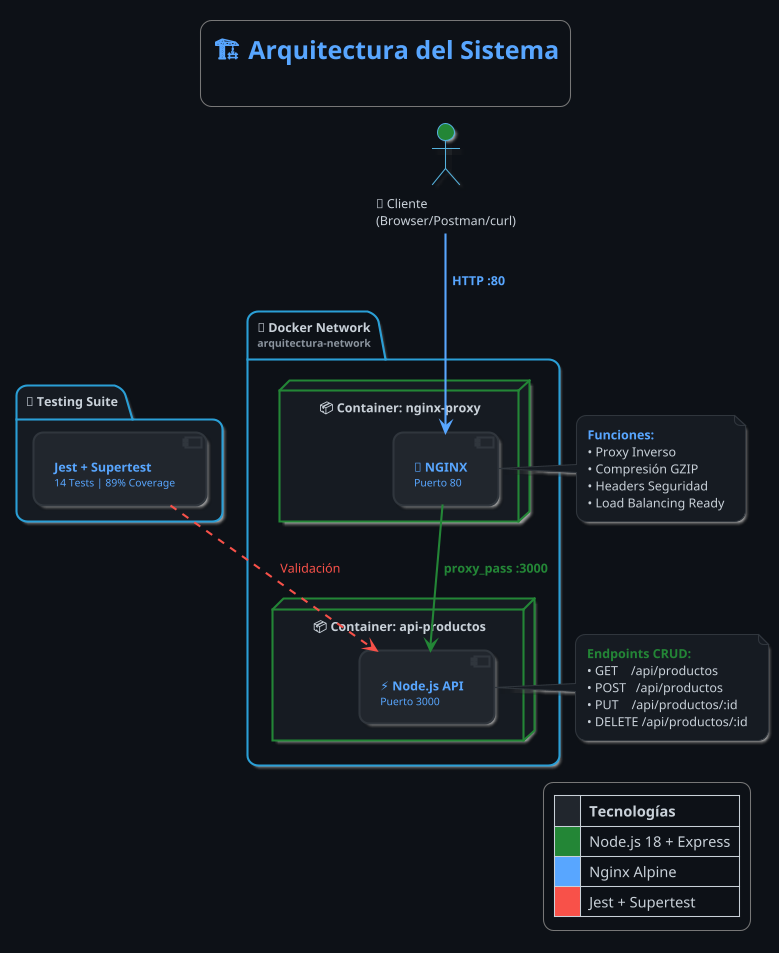

# 📄 Reporte Técnico
## Arquitectura de Despliegue, Pruebas y Monitoreo de Aplicaciones

---

<div align="center">

# 🎓 UNIVERSIDAD / INSTITUCIÓN

## 📚 Evaluación Final

### **Arquitectura de Despliegue, Pruebas y Monitoreo de Aplicaciones**

---

### 👥 Integrantes del Equipo

| # | Nombre Completo | Matrícula |
|:-:|-----------------|-----------|
| 1 | [Nombre del Integrante 1] | [Matrícula] |
| 2 | [Nombre del Integrante 2] | [Matrícula] |
| 3 | [Nombre del Integrante 3] | [Matrícula] |

---

**📅 Fecha de Entrega:** 30 de Noviembre de 2025

</div>

---

## 📋 Índice

1. [Introducción](#1-introducción)
2. [Arquitectura del Sistema](#2-arquitectura-del-sistema)
3. [Configuración Técnica](#3-configuración-técnica)
4. [Pruebas de Integración](#4-pruebas-de-integración)
5. [Evidencias y Capturas](#5-evidencias-y-capturas)
6. [Conclusiones](#6-conclusiones)

---

## 1. Introducción

Este proyecto implementa una arquitectura robusta que integra:

| Componente | Tecnología | Descripción |
|------------|------------|-------------|
| 🧪 Pruebas | Supertest + Jest | Validación de endpoints |
| 🐳 Contenedores | Docker + Compose | Contenerización de servicios |
| 🔄 Proxy | Nginx | Proxy inverso y balanceo |

**Proyecto:** API REST de gestión de productos con operaciones CRUD.

---

## 2. Arquitectura del Sistema

### 2.1 Diagrama de Arquitectura (PlantUML)



### 2.2 Flujo de Comunicación

| Paso | Origen | Destino | Descripción |
|:----:|--------|---------|-------------|
| 1️⃣ | Cliente | Nginx:80 | Petición HTTP |
| 2️⃣ | Nginx | API:3000 | Proxy inverso |
| 3️⃣ | API | Nginx | Respuesta JSON |
| 4️⃣ | Nginx | Cliente | Respuesta + Headers |

### 2.3 Estructura del Proyecto

```
📁 proyecto_completo/
├── 📁 src/
│   └── 📄 app.js              # API Express
├── 📁 tests/
│   └── 📄 api.test.js         # 14 pruebas
├── 📁 nginx/
│   ├── 📄 nginx.conf          # Config principal
│   └── 📁 conf.d/
│       └── 📄 default.conf    # Proxy inverso
├── 🐳 Dockerfile
├── 🐳 docker-compose.yml
└── 📄 README.md
```

---

## 3. Configuración Técnica

### 3.1 Docker

| Archivo | Función |
|---------|---------|
| `Dockerfile` | Imagen Node.js Alpine con usuario no-root |
| `docker-compose.yml` | Orquesta API + Nginx en red compartida |

**Servicios:**

| Servicio | Imagen | Puerto | Red |
|----------|--------|--------|-----|
| `api` | node:18-alpine | 3000 (interno) | arquitectura-network |
| `nginx` | nginx:alpine | 80 (externo) | arquitectura-network |

### 3.2 Nginx (Proxy Inverso)

| Configuración | Valor |
|---------------|-------|
| `proxy_pass` | http://api:3000 |
| Compresión | GZIP habilitado |
| Headers | X-Frame-Options, X-XSS-Protection |

---

## 4. Pruebas de Integración

### 4.1 Resumen de Pruebas (14 Tests)

| # | Endpoint | Método | Prueba | Estado |
|:-:|----------|:------:|--------|:------:|
| 1 | `/health` | GET | Estado del servidor | ✅ |
| 2 | `/api/productos` | GET | Listar productos | ✅ |
| 3 | `/api/productos` | GET | Estructura correcta | ✅ |
| 4 | `/api/productos/:id` | GET | Producto existente | ✅ |
| 5 | `/api/productos/:id` | GET | Error 404 | ✅ |
| 6 | `/api/productos` | POST | Crear producto | ✅ |
| 7 | `/api/productos` | POST | Validar nombre | ✅ |
| 8 | `/api/productos` | POST | Validar precio | ✅ |
| 9 | `/api/productos/:id` | PUT | Actualizar | ✅ |
| 10 | `/api/productos/:id` | PUT | Error 404 | ✅ |
| 11 | `/api/productos/:id` | DELETE | Eliminar | ✅ |
| 12 | `/api/productos/:id` | DELETE | Error 404 | ✅ |
| 13 | `/` | GET | Info API | ✅ |
| 14 | `/invalida` | GET | Error 404 | ✅ |

---

## 5. Evidencias y Capturas

---

### 📸 5.1 Pruebas Pasando Exitosamente

> **Comando:** `npm test`

<div align="center">

| 🧪 CAPTURA DE TESTS PASANDO |
|:---------------------------:|
| |
| **(CAPTURA AQUÍ)** |
| |
| *Insertar captura de pantalla mostrando los 14 tests pasando con el comando `npm test`* |

</div>

**✅ Resultado esperado:** 14 passed | Cobertura: 89.39%

---

### 📸 5.2 Contenedores Docker Funcionando

> **Comando:** `docker-compose ps`

<div align="center">

| 🐳 CAPTURA DE CONTENEDORES ACTIVOS |
|:----------------------------------:|
| |
| **(CAPTURA AQUÍ)** |
| |
| *Insertar captura del comando `docker-compose ps` mostrando api-productos y nginx-proxy* |

</div>

**✅ Contenedores esperados:**
- `api-productos` → Up (healthy) → 3000/tcp
- `nginx-proxy` → Up (healthy) → 0.0.0.0:80→80/tcp

---

### 📸 5.3 Proxy Inverso Funcionando

> **Comando:** `curl http://localhost/api/productos`

<div align="center">

| 🔄 CAPTURA DEL PROXY INVERSO |
|:----------------------------:|
| |
| **(CAPTURA AQUÍ)** |
| |
| *Insertar captura mostrando la respuesta JSON de la API a través del puerto 80 (Nginx)* |

</div>

**✅ Respuesta esperada:** Lista de productos en formato JSON

---

### 📸 5.4 Health Check del Sistema

> **Comando:** `curl http://localhost/health`

<div align="center">

| ❤️ CAPTURA DEL HEALTH CHECK |
|:---------------------------:|
| |
| **(CAPTURA AQUÍ)** |
| |
| *Insertar captura del endpoint /health respondiendo {"status":"OK"}* |

</div>

**✅ Respuesta esperada:** `{"status":"OK","message":"Servidor funcionando correctamente"}`

---

## 6. Conclusiones

### ✅ Requisitos Cumplidos

| Requisito | Estado | Evidencia |
|-----------|:------:|-----------|
| Pruebas de Integración (Supertest) | ✅ | 14 tests pasando |
| Contenerización (Docker) | ✅ | 2 contenedores funcionando |
| Proxy Inverso (Nginx) | ✅ | API accesible en puerto 80 |

### 📝 Aprendizajes

- **Supertest** permite validar APIs de forma aislada
- **Docker** garantiza entornos consistentes
- **Nginx** añade seguridad como capa intermedia

---

<div align="center">

---

### 📚 Proyecto desarrollado para la evaluación de
## Arquitectura de Despliegue, Pruebas y Monitoreo

*🗓️ Noviembre 2025*

---

</div>
